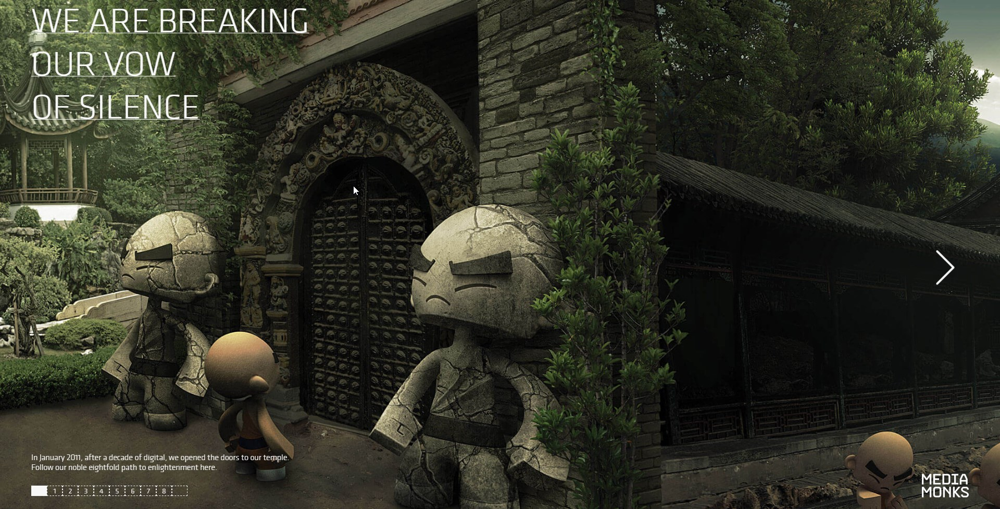
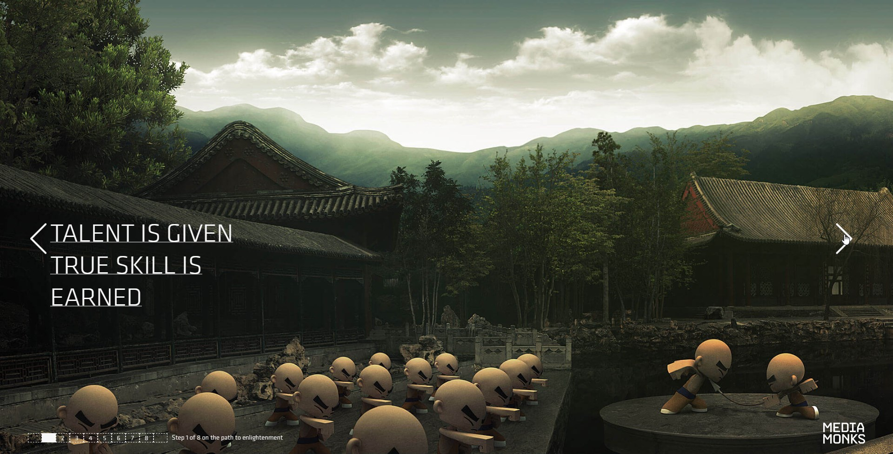
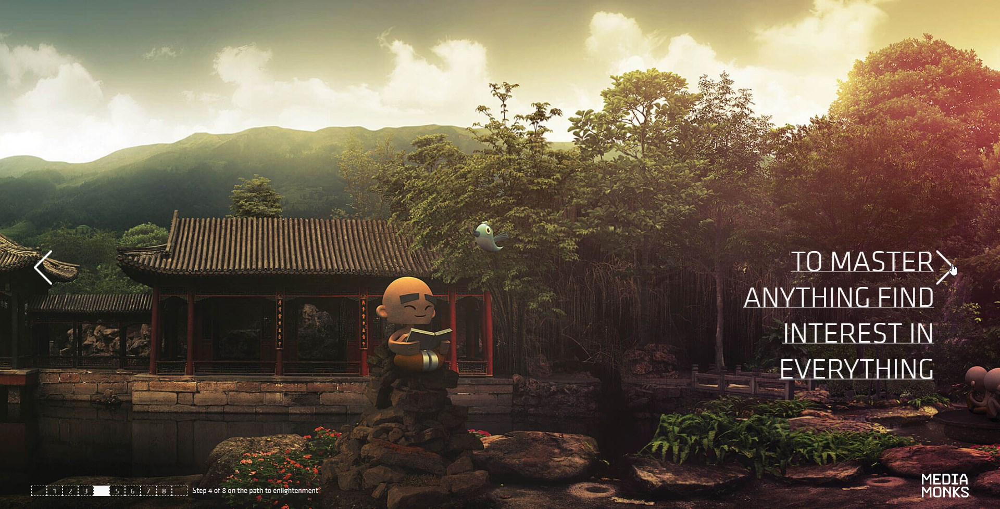
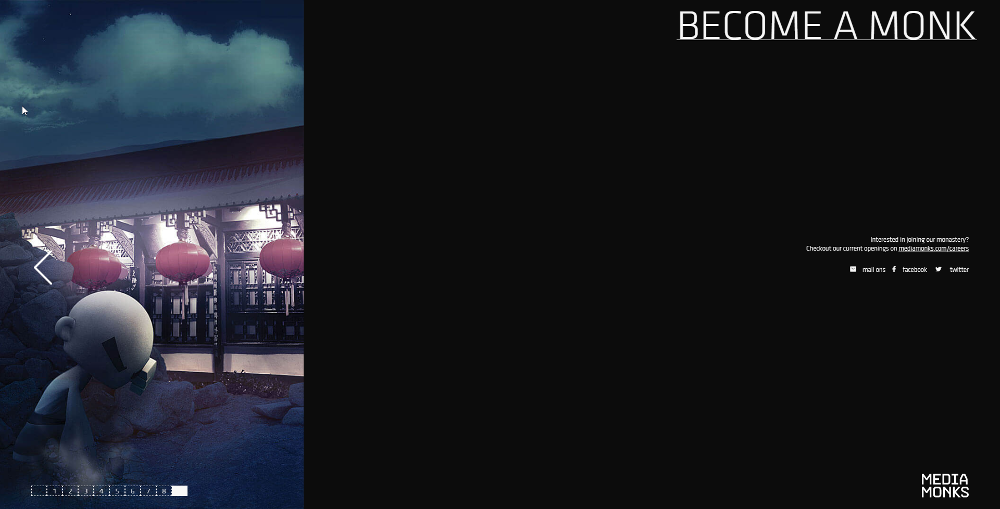
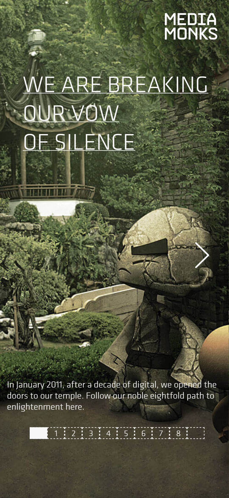
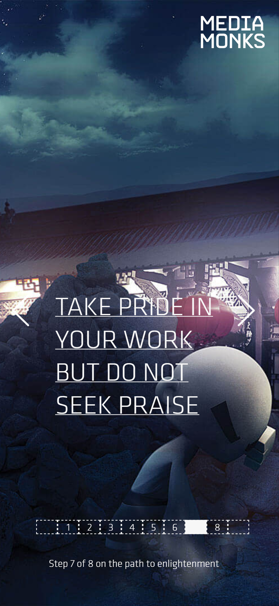
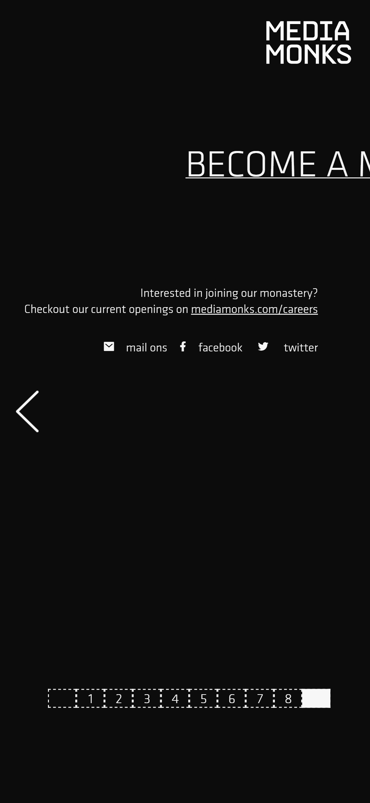

# media.monks-frontend-challenge

In order to run the project locally first install all the dependancies by running.

` $ npm install`

To run the development preview.

`$ npm run start`

Navigate to the localhost url displayed in the output the default host is `localhost:1234`

Screenshots are located in the directory `./screenshots`

## main styles

Mian styling is located in the stylesheet `./src/styles/main.css`

## Animation

Animations are implemented using [GSAP](https://greensock.com/)

## Desktop (chrome)

## Browser Chromne (mobile)

